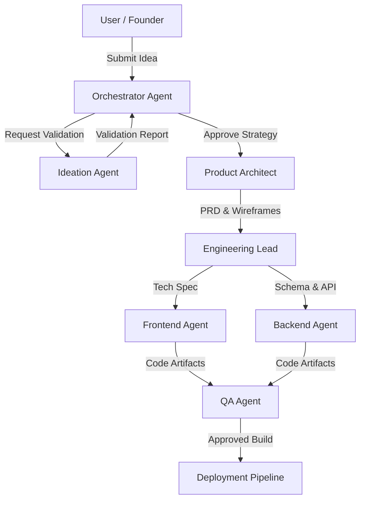

# AI Startup Ecosystem Architecture Blueprint

## 1. System Overview
**Name**: StartLabX Autonomous Incubator
**Goal**: Convert raw ideas into production-ready startups using a multi-agent AI system.
**Core Architecture**: Modular, Event-Driven, Micro-Agent System.

## 2. Agent Architecture (The "Elite Team")

The system operates via a central **Orchestrator Agent** that manages 4 specialized squads:

### Squad A: Strategy & Product (The Brain)
1. **Startup Orchestrator (CEO)**
   - *Role*: Mission control. Maintains state, directs other agents, makes final decisions.
   - *Input*: User idea.
   - *Output*: Directives to other agents.
2. **Ideation & Validation Agent**
   - *Role*: Validates market viability, researches competitors, calculates TAM/SAM.
   - *Output*: Validation Report & Pivot Suggestions.
3. **Product Architect (PM)**
   - *Role*: Defines features, user journeys, and PRDs.
   - *Output*: Roadmap, User Stories, Wireframe descriptions.
4. **UX/UI Agent**
   - *Role*: Generates design systems, flowcharts, and component specs.
   - *Output*: Design System JSON, Tailwind config.

### Squad B: Engineering (The Builders)
5. **Engineering Lead (CTO)**
   - *Role*: Selects tech stack, designs schema, plans CI/CD.
   - *Output*: Architecture Diagram, Stack Selection.
6. **Frontend Agent**
   - *Role*: Generates React/Next.js code, components, and pages.
   - *Output*: `.tsx` files, CSS.
7. **Backend Agent**
   - *Role*: Generates API routes, DB schemas, server logic.
   - *Output*: API endpoints, Prisma schema.
8. **QA & Security Agent**
   - *Role*: Reviews code, writes tests, checks for vulnerabilities.
   - *Output*: Test suites, Security Audit.

### Squad C: Operations (The Support)
9. **Legal & Compliance Agent**
   - *Role*: Generates TOS, Privacy Policy, Incorporation docs.
   - *Output*: Legal Documents.
10. **Finance Agent**
    - *Role*: Models burn rate, pricing strategy, P&L.
    - *Output*: Financial Model (Excel/JSON).
11. **Hiring Agent**
    - *Role*: Identifies skill gaps, writes JDs, suggests freelance matches.
    - *Output*: Job Descriptions, Candidate Matches.

### Squad D: GTM (The Growth)
12. **GTM & Growth Agent**
    - *Role*: Marketing strategy, ad copy, launch plan.
    - *Output*: Marketing Plan, Social Posts.

## 3. Communication Flow



## 4. Database Extentions (Prisma)

New models to support the ecosystem:

```prisma
model StartupProject {
  id          String   @id @default(cuid())
  name        String
  description String
  status      String   // 'ideation', 'validating', 'building', 'launched'
  
  // State
  currentStage String
  roadmap      String? // JSON
  techStack    String? // JSON
  
  userId      String
  user        User     @relation(fields: [userId], references: [id])
  
  agentTasks  AgentTask[]
  generatedAssets GeneratedAsset[]
}

model AgentTask {
  id          String   @id @default(cuid())
  agentRole   String   // 'ceo', 'cto', 'pm', etc
  status      String   // 'pending', 'processing', 'completed', 'failed'
  input       String   // JSON
  output      String?  // JSON result
  
  projectId   String
  project     StartupProject @relation(fields: [projectId], references: [id])
}

model GeneratedAsset {
  id          String   @id @default(cuid())
  type        String   // 'code', 'document', 'design', 'image'
  content     String   // Text content or URL
  path        String?  // File path in repo
  
  projectId   String
  project     StartupProject @relation(fields: [projectId], references: [id])
}
```

## 5. Implementation Roadmap

### Phase 1: The "Incubator" Interface (Subscription Part)
- [ ] Create `Subscription` tiers (Founder, Unicorn).
- [ ] Build the `Incubator` dashboard.
- [ ] Implement the "Chat with Co-founder" interface (Orchestrator).

### Phase 2: Agent Logic (Mocked & Real)
- [ ] Implement `AgentTask` processing queue.
- [ ] Integrate LLM (OpenAI/Gemini) for Ideation & Validation.
- [ ] Generate static documents (PRDs, Marketing Plans).

### Phase 3: Code Generation (Advanced)
- [ ] Connect `Frontend Agent` to generate actual React components.
- [ ] Implement "One-click Sandbox" to preview generated startups.
