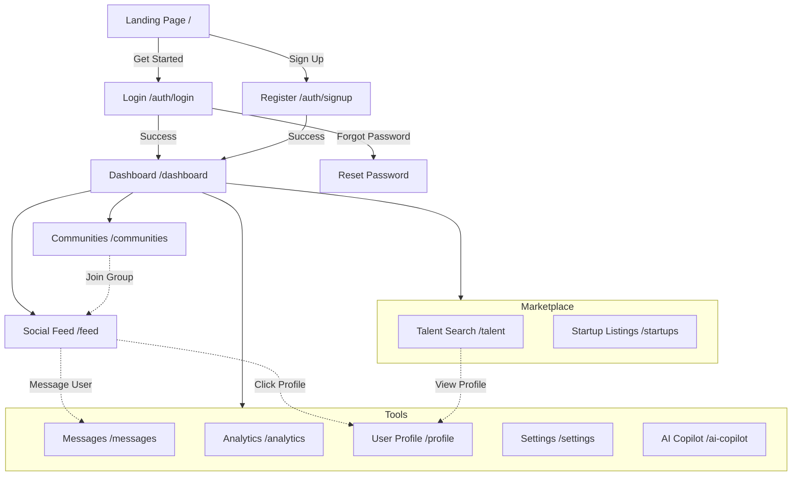

# 🗺️ STARTLABX - Frontend Architecture & User Flow

This document outlines the user navigation flow, key pages, and feature hierarchy of the STARTLABX application.

## 🔄 User Journey Map

---

## 🏗️ Page Structure & Features

### 1. **Public Zone** (Unauthenticated)
- **Landing Page** (`/`): 
  - Hero section with value proposition
  - Feature highlights (AI, Marketplace, Community)
  - Call to Action (Login/Register)
  - Footer with legal links

### 2. **Authentication Zone** (`src/app/(auth)`)
- **Login** (`/auth/login`): 
  - Email/Password credentials
  - Social login options (placeholder)
  - Link to registration
- **Register** (`/auth/signup`): 
  - Account creation form
  - Role selection (Startup/Professional)
- **Password Reset** (`/auth/reset-password`): 
  - Recovery flow

### 3. **Application Zone** (`src/app/(app)`)
Protected routes requiring authentication, wrapped in the main `AppLayout`.

#### 🏠 **Core Dashboard** (`/dashboard`)
- **Overview**: High-level stats (views, engagement).
- **Recent Activity**: Activity feed of likes, follow, comments.
- **Quick Actions**: Shortcuts to create posts, find talent.
- **Charts**: Growth trends visualization.

#### 📡 **Social & Community**
- **Feed** (`/feed`): 
  - Real-time social wall (Tweets/Posts style).
  - Create posts with media/hashtags.
  - Like, comment, and share functionality.
- **Communities** (`/communities`): 
  - Browse and join interest groups (e.g., "AI Founders", "Designers").
  - Access group-specific discussions.
- **Messages** (`/messages`): 
  - Real-time chat interface.
  - Conversation list and direct messaging.

#### 💼 **Marketplace**
- **Startups** (`/startups`): 
  - Directory of startups seeking talent/funding.
  - Filter by industry, stage, and location.
- **Talent** (`/talent`): 
  - Searchable database of professionals.
  - Filter by skills (React, Design, Marketing).
  - "Hire" or "Connect" actions.

#### 🛠️ **Tools & Utilities**
- **AI Copilot** (`/ai-copilot`): 
  - AI assistant for drafting content or business advice.
- **Analytics** (`/analytics`): 
  - Detailed performance metrics.
  - Audience insights.
- **Notifications** (`/notifications`): 
  - Centralized alert center for interactions.

#### ⚙️ **User Management**
- **Profile** (`/profile/[id]`): 
  - User bio, skills, portfolio, and activity history.
- **Settings** (`/settings`): 
  - Account preferences, notification settings, billing.
- **Pricing** (`/pricing` & `/subscription`): 
  - Upgrade plans and subscription management.

---

## 🎨 UI/UX Design System

The frontend follows a **"Premium Glassmorphism"** aesthetic:
- **Glass Effect**: Translucent cards with blur (`backdrop-filter: blur()`).
- **Gradients**: Rich, animated text and background gradients (`text-gradient-primary`).
- **Animations**: 
  - `animate-slide-up`: Smooth entry for cards.
  - `animate-shimmer`: Loading states.
  - `hover-lift`: Interactive feedback on buttons.
- **Theme**: Dark-mode first, with high-contrast accents (Purple/Blue/Gold).

## ⚡ Real-Time Integration
- **Socket.IO Client**: 
  - Listens for events: `new_post`, `receive_message`, `notification`.
  - Updates UI instantly without page refresh.
  - Shows "User is typing..." indicators.

---

## 🧩 Key Components

- **`Providers`**: Wraps app with Auth, Toast, and Loading contexts.
- **`Sidebar` / `Navbar`**: Persistent navigation shell.
- **`FeatureCard`**: Reusable component for lists (Startups/Talent).
- **`FeedItem`**: Complex component for posts (interactive).
- **`RealtimeService`**: Singleton service managing WebSocket connections.
